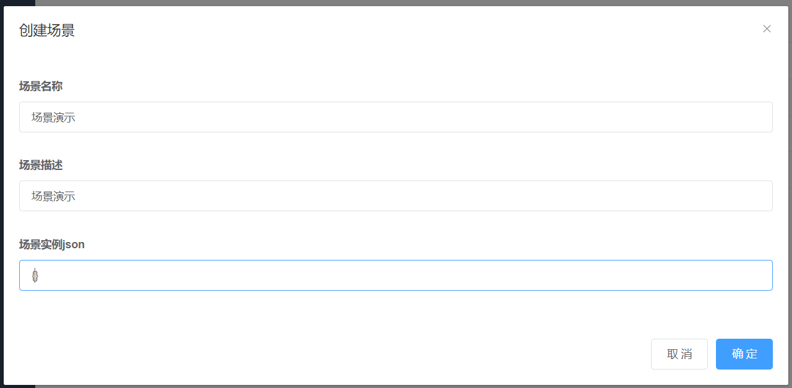
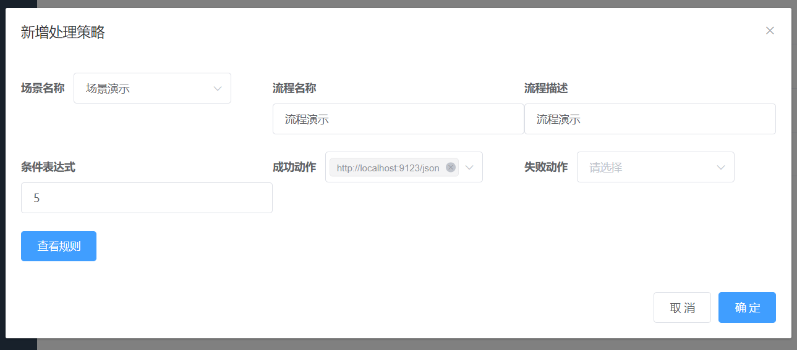

# 实体规则服务
- 项目说明: 根据场景、json对象和规则发送HTTP请求


## 安装
- 前端项目安装

```shell
cd ui
npm install 
npm run dev
```

- 后端项目安装
  1. 创建数据库，数据库初始化文件位于ews\db中，文件名为ews.sql
  2. 编译jar

```shell
mvn clean install package
cd ews\target
java -jar ews-1.0-SNAPSHOT.jar

```


## 使用

在经过安装操作后通过浏览器访问http://localhost:9528/，输入任意账号密码进入系统。系统界面如下


本系统包含四个核心模块：场景、规则、行动和处理策略。

### 创建场景

进入侧边栏中的场景摸，点击新增后弹出如图所示内容。



根据输入框进行数据输入，点击确定按钮完成创建。创建后内容如图所示


### 规则创建

下面介绍规则的创建，进入侧边栏规则模块后点击新增弹出如图所示内容。


根据输入要求输入具体数据，注意值提取式需要符合json-path的语法要求，输入完成后点击确定，页面显示情况如图所示。


### 行动创建

下面介绍行动的创建，进入侧边栏行动模块后点击新增弹出如图所示内容。


如果还需要添加参数请点击新增参数按钮，弹出如图所示内容


在图中值提取式需要符合json-path的语法，目标键需要符合properties文件的编写语法，点击确定后数据如图所示


点击确定后数据如图所示是


### 处理策略创建


下面介绍处理策略的创建，进入侧边栏处理策略模块后点击新增弹出如图所示内容。



在上图中条件表达式需要使用者自行编写，如果需要复杂表达式可以查看规则选择其中的数字ID将其通过 规则ID 、 && 、|| 和()的方式进行组合。上图含义为规则5校验成功后执行http://localhost:9123/json的请求发送。


### 模拟请求


发送后可以在控制台看到如下输出

```
2021-07-30 09:45:59.890  INFO 15664 --- [nio-8080-exec-2] c.g.h.ews.service.HandlerScenesService   : el琛ㄨ揪寮忎慨姝ｅ墠=[5],淇鍚�=[true]
2021-07-30 09:45:59.894  INFO 15664 --- [nio-8080-exec-2] c.g.h.ews.service.HandlerScenesService   : 褰撳墠澶勭悊瀵硅薄=[Process{id=5, scenesId=5, expression='5', name='流程演示', description='流程演示'}],澶勭悊缁撴灉=[true]
2021-07-30 09:45:59.895  INFO 15664 --- [nio-8080-exec-2] c.g.h.ews.service.HandlerScenesService   : 褰撳墠姝ｅ湪澶勭悊http璇锋眰=[http://localhost:9123/json],param=[{age=10}],httpMethod=[POST_JSON]
{"age":"10"}
```


## 设计说明

本项目涉及四个模块：场景、规则、行动、处理策略，在一个场景中包含多个规则、多个行动和多个处理策略。在处理策略中会涉及到规则以及行动，其中规则的判断是根据el表达式进行处理，规则中的数据提取需要依赖json-path，规则中的数据源是json数据，在行动中也会涉及到数据转换过程，其中数据提取依赖json-path，数据设置依赖properties文件编写语法。


